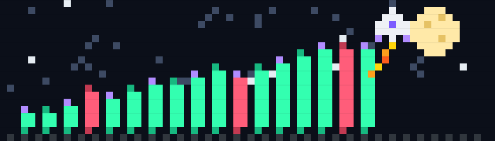

<div align="center">




[](https://linkedin.com/in/ayush-rai-808999dgcd)
[](https://leetcode.com/u/drainbadenergy)
[](mailto:ayushrai2005dbl@gmail.com)


</div>

```bash
ayush@terminal:~$ whoami
> B.Tech CSE @ Symbiosis Institute of Technology, Pune — Class of 2028 (CGPA 8.1)
> Full-Stack Dev Intern @ DoughAsYouLike — Next.js / Express / MongoDB
> Co-inventor on an Indian patent for IoT-based health monitoring
> Currently teaching a PPO agent not to blow up a crypto portfolio
> Status: probably debugging a stale API response cache somewhere
```

<!--TICKER:START-->
### 📡 live from the trading terminal
`🟢 BTC —,— · 🟢 ETH —,—` — refreshes every 6h via [update_ticker.py](./scripts/update_ticker.py), the same feed [TYCHE](#-tyche--crypto-quant-rl-agent) trains on. First run fills this in.
<!--TICKER:END-->

---

### 🚀 currently

- 🔭 Building **TYCHE** — a PPO agent that has survived a simulated flash crash, a liquidity crisis, and a pump-and-dump without touching my actual savings
- 🛠️ Shipping inventory tooling at **DoughAsYouLike** — RBAC, optimistic concurrency, and the occasional 2am stale-cache bug
- 🌱 Reading up on market microstructure and multi-agent RL
- 💬 Ask me about: JWT auth done properly, MongoDB version-key concurrency, or why my trading bot respects stop-losses better than most humans do
- ⚡ Fun fact: I'm a co-inventor on an Indian patent application before finishing my degree

---

### 🧠 featured builds

<table>
<tr>
<td width="50%" valign="top">

**🪐 TYCHE — Crypto Quant RL Agent**
<br/>
PPO agent over a 35-dim state across 5 assets (BTC/ETH/BNB/SOL/ADA), custom Gym env with a 243-action portfolio space, stress-tested against flash crashes and pump-and-dumps.

Trained on 31.5M Binance data points → **15–18% annualized backtested returns**, **Sharpe > 1.2**, fees and slippage included.

`Python` `PyTorch` `Flask` `MongoDB` `Streamlit`

</td>
<td width="50%" valign="top">

**📈 NSE Breakout Screener + Telegram Bot**
<br/>
CLI screener across 467 NSE stocks with a 6-gate filter (trend, volatility contraction, relative strength, institutional volume, breakout, anti-chase buffer), all vectorized in pandas.

Dockerized, deployed on AWS EC2, cron-scheduled for zero-touch daily alerts straight to Telegram.

`Python` `Pandas` `Telegram API` `Docker` `AWS`

</td>
</tr>
</table>

---

### 🧰 stack

<div align="center">


</div>

---

### 📊 stats

<div align="center">


<picture>
  <source media="(prefers-color-scheme: dark)" srcset="https://raw.githubusercontent.com/drainbadenergy/drainbadenergy/output/github-contribution-grid-snake-dark.svg" />
  
</picture>

</div>

> if a card above looks broken: it's almost always the shared public stats instance getting rate-limited, not your repo — see `SETUP.md` for the self-host fix.

---

### 🏆 achievements & leadership

- 📜 **Indian Patent Application 202621052095 A** (2025–2026) — co-inventor, IoT-based real-time health monitoring (heart rate, SpO2, temperature)
- 🎨 **Design & Media Team Head**, Matheletes Club & CodeX Club, SIT Pune — leading a team of 10 since Aug 2024
- 🌐 **Hacktoberfest 2024** — 4+ merged PRs into open-source repos

<div align="center">

<sub>thanks for scrolling this far — now go build something.</sub>
</div>
